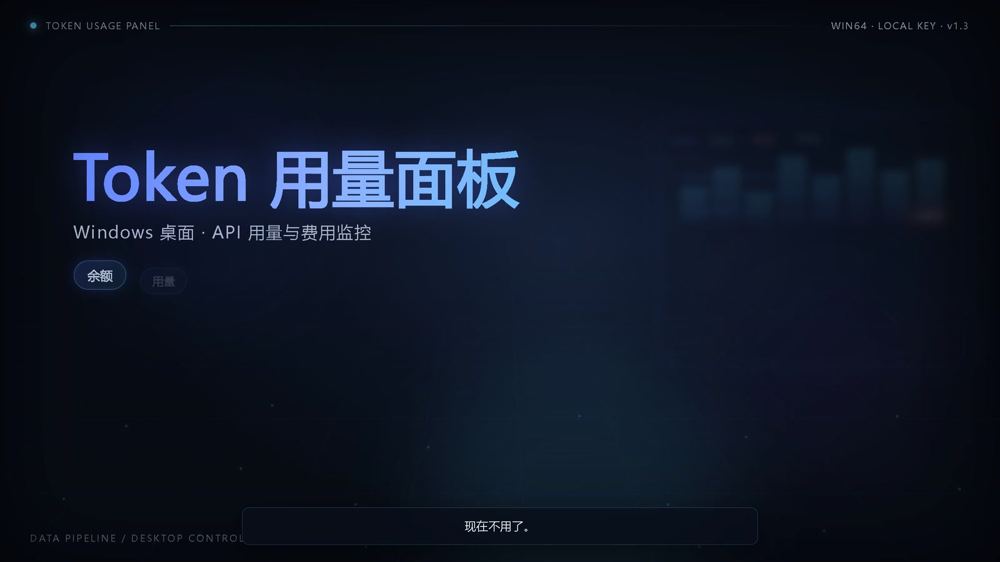
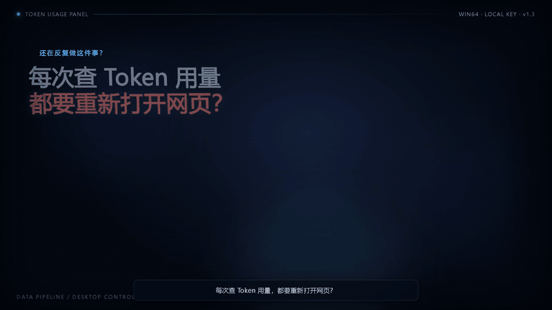
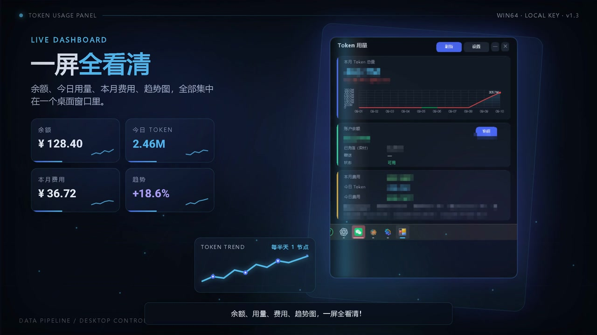
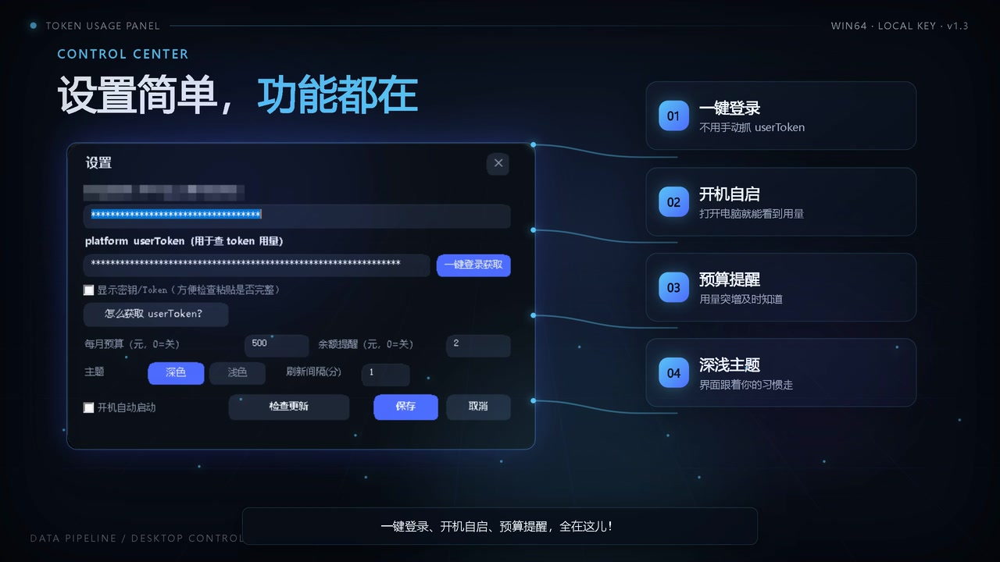
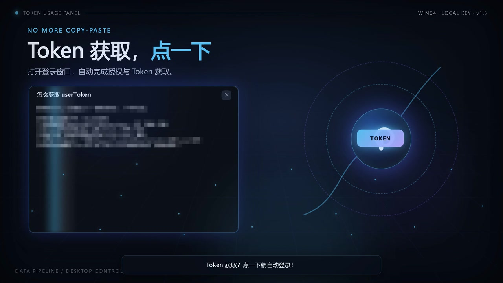
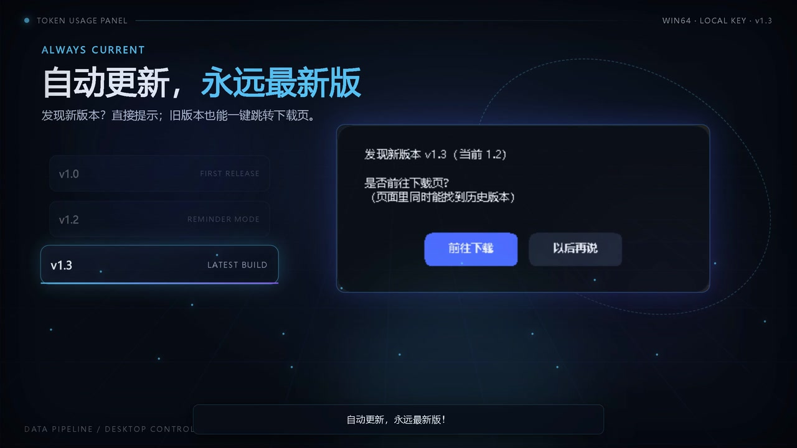

# Token 用量面板

**DeepSeek API 余额、用量、费用、趋势，一屏看清。**

Windows 10 / 11 · 本地运行 · Key 不上传 · 免费使用

### [⬇️ 下载最新版](https://github.com/WXHLR/token-usage-panel/releases/latest)

  

---

## 为什么值得装

每次查 DeepSeek 用量都要重新打开网页，在余额、费用、Token、趋势图之间来回切换？

**Token 用量面板**把这些信息集中到一个 Windows 桌面窗口里。双击就能看，数据只在本机处理，不需要把 API Key 交给第三方服务。

| 你遇到的问题 | 这个工具怎么解决 |
|---|---|
| 每次都要开浏览器查用量 | Windows 桌面窗口，双击即看 |
| 余额、费用、Token 分散在不同页面 | 余额、今日用量、本月费用、趋势图集中展示 |
| userToken 要手动从 F12 里抓 | 内置登录窗口，一键自动获取 |
| Key 被刷或费用突然上涨 | 今日用量突增提醒 |
| 每次更新都要重新找下载页 | 自动检查更新，一键跳转下载 |
| API Key 不敢交给网站 | 只保存在本机，不上传服务器 |

## 核心功能

- **账户总览**：余额、已充值、赠送额度
- **用量统计**：本月 / 今日 Token 与费用
- **趋势图**：近 10 天用量趋势，红涨绿跌
- **模型拆分**：按模型查看用量、缓存命中率
- **一键登录**：内置浏览器自动获取 userToken
- **预算提醒**：今日用量突增时通知，防止 Key 被刷
- **数据导出**：一键复制报告 / 导出 CSV
- **桌面体验**：开机自启、系统托盘、单实例保护
- **主题切换**：深色 / 浅色主题
- **自动更新**：发现新版本直接提示

---

## 下载与安装

到 **Releases** 页面下载最新的 Windows 64 位压缩包：

### [前往 Releases 下载](https://github.com/WXHLR/token-usage-panel/releases/latest)

解压后有两种用法：

| 方式 | 适合谁 | 操作 |
|---|---|---|
| **正式安装（推荐）** | 想当普通软件用 | 双击 `Token用量面板-安装程序.exe`，自动创建桌面和开始菜单快捷方式，并支持卸载 |
| **免安装绿色版** | 想直接试用 | 双击 `Token用量.exe`，不写注册表 |

> Windows 如果提示“未知发布者 / SmartScreen”，点 **更多信息 → 仍要运行** 即可。这是因为程序没有购买代码签名证书。

---

## 首次使用

1. 双击 `Token用量.exe`
2. 在设置中填入 DeepSeek **API Key**
3. 点击 **一键登录获取** userToken
4. 保存后，之后每次打开就能直接查看用量

<strong>API Key 和 userToken 去哪里拿？</strong>

打开并登录 [DeepSeek 开放平台](https://platform.deepseek.com)：

- **API Key**：进入 `API Keys` 页面创建一个，形如 `sk-xxxxxx`
- **userToken**：可以用软件内置的“一键登录获取”功能；如果系统缺少 WebView2 运行时，也可以手动打开 F12 → Application → Cookies → 找到 `platform.deepseek.com` 下的 `userToken`

---

## 界面预览

| 主界面 | 设置页 |
|---|---|
|  |  |

| 一键获取 userToken | 检查更新 |
|---|---|
|  |  |

---

## 隐私与安全

- API Key / userToken 只保存在本机：`%APPDATA%\TokenUsagePanel\config.json`
- 不上传账号信息，不经过第三方服务器
- 不修改 DeepSeek 平台数据，只读取你自己的用量信息
- 程序为第三方非官方工具，与 DeepSeek 无隶属关系

## 常见问题

<strong>Windows 提示“未知发布者”怎么办？</strong>

点 **更多信息 → 仍要运行**。当前版本没有购买数字签名证书，这不代表程序不能使用。

<strong>一键登录窗口打不开怎么办？</strong>

通常是系统缺少 WebView2 运行时。可以安装 Microsoft Edge WebView2 Runtime，或改用手动 F12 获取 userToken。

<strong>会让我的 API Key 被上传吗？</strong>

不会。Key 和 userToken 只写入本机 `%APPDATA%\TokenUsagePanel\config.json`，程序不会把它们上传到服务器。

<strong>支持哪些系统？</strong>

Windows 10 / 11 64 位。

<strong>发现 Bug 或想提功能建议？</strong>

欢迎到 [Issues](https://github.com/WXHLR/token-usage-panel/issues) 反馈。描述问题时附上系统版本、操作步骤和截图，会更快定位。

---

## 更新记录

- **v1.3**：输入框圆角、弹窗统一主题、独立 userToken 说明窗口、赞赏入口、任务栏图标
- **v1.2**：今日用量突增提醒、开机自启、自动检查更新
- **v1.1**：一键登录获取 userToken，内置浏览器
- **v1.0**：首个正式版本

---

### 如果它帮你省了时间，欢迎点一个 ⭐ Star

[⬇️ 下载最新版](https://github.com/WXHLR/token-usage-panel/releases/latest) ·
[🐛 反馈问题](https://github.com/WXHLR/token-usage-panel/issues) ·
[❤️ 赞赏支持](https://afdian.com/a/freedom0416)

