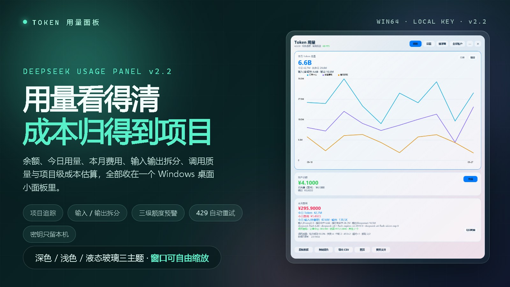
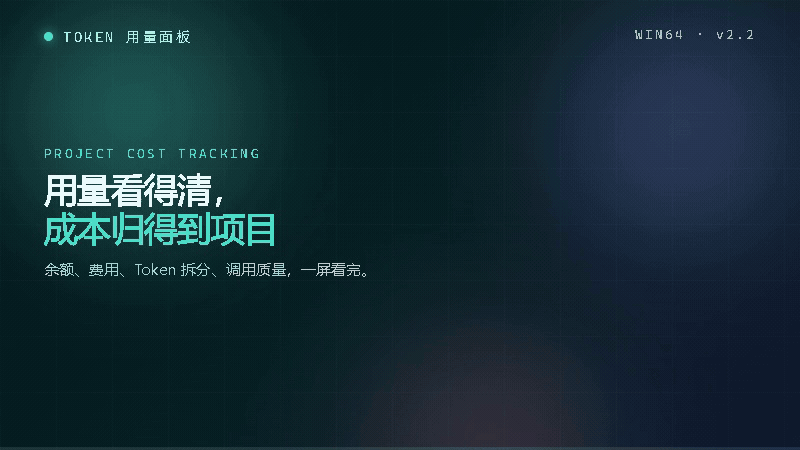
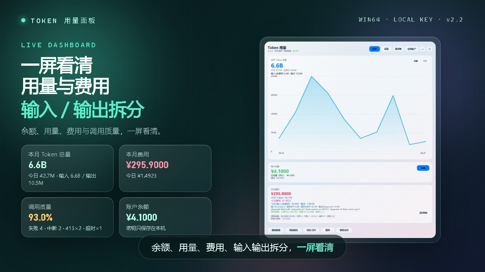
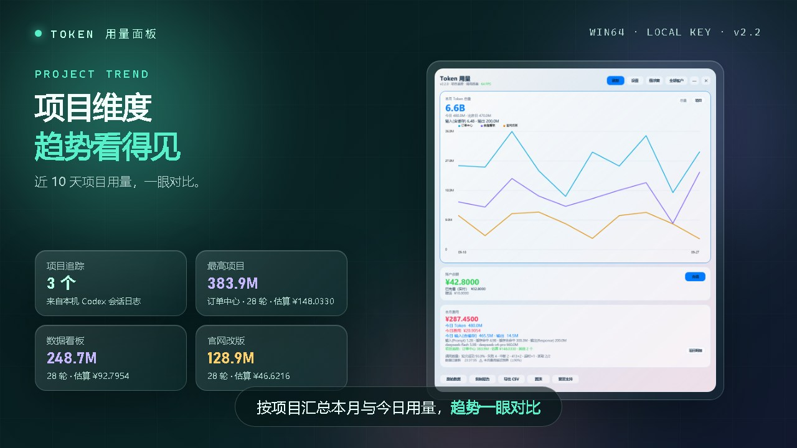
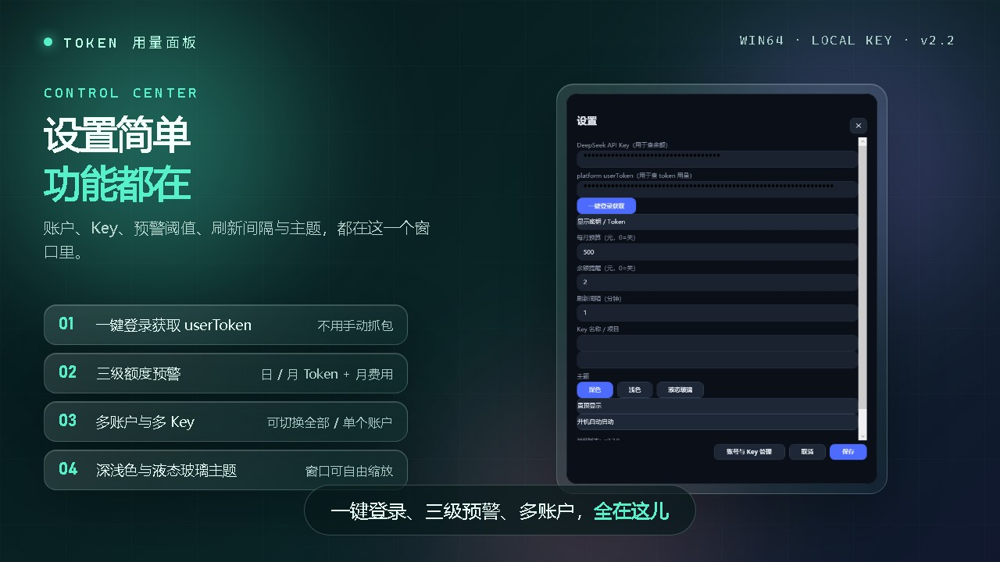
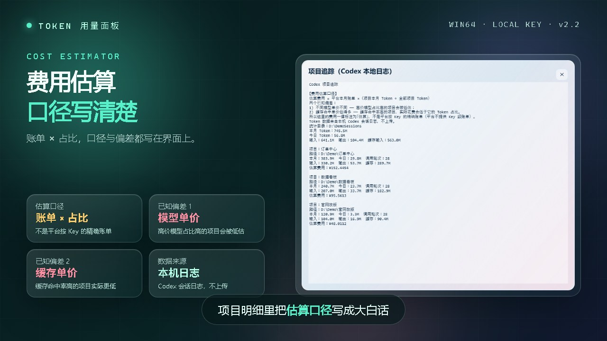

# Token 用量面板

**AI 用量与额度总控台，本地优先 · 多 Provider / 多 API Key。**

Windows 10 / 11 · 本地运行 · Key 不上传 · 免费使用

### [⬇️ 下载最新版](https://github.com/WXHLR/token-usage-panel/releases/latest)

  

  

---

## 为什么值得装

每次查 DeepSeek 用量都要重新打开网页，在余额、费用、Token、趋势图之间来回切换？

**Token 用量面板**把这些信息集中到一个 Windows 桌面窗口里。双击就能看，数据只在本机处理，不需要把 API Key 交给第三方服务。当前 DeepSeek 已完整可用，OpenRouter 已接入额度和 activity 读取。

| 你遇到的问题 | 这个工具怎么解决 |
|---|---|
| 每次都要开浏览器查用量 | Windows 桌面窗口，双击即看 |
| 余额、费用、Token 分散在不同页面 | 余额、今日用量、本月费用、趋势图集中展示 |
| userToken 要手动从 F12 里抓 | 内置登录窗口，一键自动获取 |
| Key 被刷、费用突然上涨或余额不足 | 费用突增 / 低余额提醒，系统通知 + 悬浮窗警示 |
| 每次更新都要重新找下载页 | 自动检查更新，一键跳转下载 |
| API Key 不敢交给网站 | 只保存在本机，不上传服务器 |

## 核心功能

- **灵动岛悬浮窗**：今日 Token、今日费用、剩余余额集中显示
- **边缘吸附**：左右边纵向布局，上下边横向布局，角落双向吸附
- **账户总览**：余额、已充值、赠送额度
- **用量统计**：本月 / 今日 Token 与费用
- **趋势图**：支持 **7 天 / 30 天 / 90 天**与「总量 / 项目」切换，跨月自动补拉历史月份
- **账户导入 / 导出**：单个账户可导出成 JSON（含密钥，有提示），也可导入为新账户
- **输入 / 输出拆分**：本月与今日分别显示输入（含缓存）与输出 Token，恒有「输入 + 输出 = 总量」
- **调用质量**：轮次成功率 / 失败 / 中断与失败原因（来自本机 Codex 会话日志，不上传）
- **模型拆分**：按模型查看用量、缓存命中率
- **多账户 / 多 Key**：支持多个账户，每个账户可管理多个 API Key；多账户时可切换全部或单个账户
- **多 Provider 基础**：Provider / Key 管理、DPAPI 加密凭据库、能力矩阵；DeepSeek 完整可用，OpenRouter 支持余额和 activity
- **Key 与项目**：需要时直接命名 Key、关联项目和环境标签，主页面和导出中同步显示
- **费用归因**：最高费用模型、最高单日、日均和本月预计费用
- **一键登录**：内置浏览器自动获取 userToken
- **预算与异常**：月底费用预测、Burn Rate、预算 / 余额耗尽天数、今日费用异常提醒
- **异常提醒**：今日费用达到近 7 天平均值的 2 倍，或余额不足约一天使用时通知
- **数据管理**：一键复制报告 / 跨 Provider CSV / JSON 导出 / 备份和恢复配置
- **桌面体验**：开机自启、系统托盘、单实例保护
- **主题切换**：深色 / 浅色主题
- **自动更新**：发现新版本直接提示

---

## 下载与安装

到 **Releases** 页面下载最新的 Windows 64 位压缩包：

### [前往 Releases 下载](https://github.com/WXHLR/token-usage-panel/releases/latest)

解压后有两种用法：

| 方式 | 适合谁 | 操作 |
|---|---|---|
| **正式安装（推荐）** | 想当普通软件用 | 双击 `Token用量面板-安装程序.exe`，自动创建桌面和开始菜单快捷方式，并支持卸载 |
| **免安装绿色版** | 想直接试用 | 双击 `Token用量.exe`，不写注册表 |

> Windows 如果提示“未知发布者 / SmartScreen”，点 **更多信息 → 仍要运行** 即可。这是因为程序没有购买代码签名证书。

---

## 首次使用

1. 双击 `Token用量.exe`
2. 在设置中填入 DeepSeek **API Key**
3. 点击 **一键登录获取** userToken
4. 需要区分 Key 或项目时，可顺手填写名称；不填也能正常使用
5. 保存后，之后每次打开就能直接查看用量

<strong>API Key 和 userToken 去哪里拿？</strong>

打开并登录 [DeepSeek 开放平台](https://platform.deepseek.com)：

- **API Key**：进入 `API Keys` 页面创建一个，形如 `sk-xxxxxx`
- **userToken**：可以用软件内置的“一键登录获取”功能；如果系统缺少 WebView2 运行时，也可以手动打开 F12 → Application → Cookies → 找到 `platform.deepseek.com` 下的 `userToken`

---

## 宣传片（v2.2）

  

  <b>20 秒</b> · 输入 / 输出拆分 · 调用质量 · 项目趋势 &nbsp;|&nbsp;
  <a href="assets/promo/v22-promo-1080p.mp4">▶ 观看 1080p 完整版</a>

---

## 界面预览

| 主界面（含输入 / 输出拆分、调用质量） | 项目维度趋势（总量 / 项目切换） |
|---|---|
|  |  |

| 设置页 | 项目明细与费用估算口径 |
|---|---|
|  |  |

---

## 隐私与安全

- API Key / userToken 只保存在本机：`%APPDATA%\TokenUsagePanel\config.json`
- 不上传账号信息，不经过第三方服务器
- 不修改 DeepSeek 平台数据，只读取你自己的用量信息
- 程序为第三方非官方工具，与 DeepSeek 无隶属关系

## 常见问题

<strong>Windows 提示“未知发布者”怎么办？</strong>

点 **更多信息 → 仍要运行**。当前版本没有购买数字签名证书，这不代表程序不能使用。

<strong>一键登录窗口打不开怎么办？</strong>

通常是系统缺少 WebView2 运行时。可以安装 Microsoft Edge WebView2 Runtime，或改用手动 F12 获取 userToken。

<strong>会让我的 API Key 被上传吗？</strong>

不会。Key 和 userToken 只写入本机 `%APPDATA%\TokenUsagePanel\config.json`，程序不会把它们上传到服务器。

<strong>支持哪些系统？</strong>

Windows 10 / 11 64 位。

<strong>发现 Bug 或想提功能建议？</strong>

欢迎到 [Issues](https://github.com/WXHLR/token-usage-panel/issues) 反馈。描述问题时附上系统版本、操作步骤和截图，会更快定位。

## v2.5.10 更新

- **重复启动更顺手**：再次双击图标时，已有窗口会被恢复到前台
- **不再弹提示框**：去掉了原来那个「已经在运行」的 MessageBox —— 它既不激活窗口，又要手动关掉
- 单实例保护本身不变：重复启动不会跑第二个同步实例（这点用实测纠正过一次误判）
- **回归**：v2 服务测试 666 项全绿

## v2.5.9 更新

- **把 Base URL 说明白**：Provider 窗口的输入框现在写清它同时影响模型校验与管理员账单
- **场景提示**：留空 = 官方端点；填写后可指向中转 / 代理域名 —— 官方域名不可达时靠它兜底
- **账单窗口同步引导**：在那里也能看到该去哪里改
- **回归**：v2 服务测试 657 项全绿

## v2.5.8 更新

- **管理员账单支持自定义端点**：OpenAI / Anthropic 的用量与费用请求会走你在连接里填的 Base URL
- **修复缺陷**：此前该覆盖值只对模型校验生效，账单路径一直忽略它 —— 任何中转端点都走不通
- **安全回退**：覆盖值为空或空白时自动回退官方默认域名，老用户零影响
- **回归**：v2 服务测试 **657 项全绿**

## v2.5.7 更新

- **状态只记真实同步**：空闲检查不再用「无需同步」覆盖上次真实结果
- **最近检查进 tooltip**：主行只反映真正跑过的同步，鼠标悬停可看最近一次检查
- **重启不丢**：从已落盘时间戳恢复「上次同步」，不再误显示「等待首次同步」
- **回归**：v2 服务测试 **641 项全绿**

## v2.5.6 更新

- **不再冻结窗口**：自动同步整条链移到后台线程（实测一次同步约 10 秒，此前会卡住 UI）
- **重入守卫**：同一时刻只跑一个自动同步
- **状态可视**：主窗口新增「自动同步」状态行 —— 已关闭 / 等待首次同步 / 运行中… / 上次结果
- **结果可读**：显示上次同步是成功还是失败，并带上详情（如「汇率成功 / 价格 438 条」）
- **回归**：v2 服务测试 **618 项全绿**

## v2.5.5 更新

- **自动同步**：复用刷新定时器，按间隔自动跑汇率与价格同步（默认关闭）
- **频率限制**：`SyncPolicy` 决定该不该同步，非法间隔用 1440 分钟兜底
- **缓存清理**：`SyncCacheCleaner` 按保留天数清理同步历史
- **留痕**：每次自动同步写一条记录，可追溯上次 / 下次时间
- **失败安全**：同步失败不清空已有汇率或价格规则
- **回归**：v2 服务测试 **602 项全绿**

## v2.5.4 更新

- **自动汇率**：汇率窗口新增「从网络同步」，一键抓取 Frankfurter 实时汇率
- **公开价格同步**：价格窗口新增「同步 OpenRouter 价格」，拉取公开模型单价
- **换算口径**：OpenRouter 价格由 per-token 换算为每百万 token
- **手工规则保留**：同步只覆盖 OpenRouter 规则，其他 Provider 手工价格不受影响
- **回归**：v2 服务测试 **570 项全绿**

## v2.5.3 更新

- **官方账单缓存**：OpenAI / Anthropic usage / cost 报告支持 TTL 缓存
- **默认 TTL**：30 分钟，可通过 `billing_cache_minutes` 配置
- **持久化**：缓存写入 `data/billing/billing-cache.json`
- **强制刷新**：账单窗口新增“强制刷新”，跳过缓存重新请求
- **安全**：缓存仅包含报告，不包含管理员 Key
- 回归：v2 服务测试 **559 项全绿**

## v2.5.2 更新

- OpenAI / Anthropic 官方用量与费用接口支持分页
- 最多读取 50 页，避免管理员账单数据被截断
- 支持按 `project_id` 过滤
- 429 限流返回可读错误
- 跨页结果合并进同一个账单报告
- 回归：v2 服务测试 **555 项全绿**

## v2.5.1 更新

- **OpenAI 管理员账单**：读取组织级用量与费用报告
- **Anthropic 管理员账单**：读取组织级用量与费用报告
- **统一账本导入**：官方用量与费用归一化后写入账本，来源标记为 Official
- **Provider 账单窗口**：Provider 总览 → 账单，选择连接和周期读取 / 导入
- **Gemini 边界**：官方账单需要 Google Cloud Billing / Monitoring，保持 RequiresAdminScope
- 回归：v2 服务测试 **551 项全绿**

## v2.5.0 更新

- **加密备份**：PBKDF2 + AES-256-CBC + HMAC-SHA256，正确密码才能恢复
- **加密恢复**：错误密码和篡改数据会被拒绝
- **账本修复压缩**：跳过损坏行、同键保留最后一条，修复前自动备份
- **导入批次回滚**：按批次删除账本记录，保留原始导入文件
- **恢复冲突预览**：恢复前显示新增 / 覆盖文件数和受影响账本文件数
- **界面入口**：报告 / 备份窗口新增加密备份、恢复加密备份、修复压缩；导入窗口新增回滚选中批次
- 回归：v2 服务测试 **527 项全绿**

## v2.4.6 更新

- **备份恢复**：选择备份 ZIP，校验账本 / 价格规则 / 导入批次后恢复
- **恢复前安全备份**：恢复前自动再生成当前数据 ZIP
- **安全边界**：恢复不覆盖 `config.json` 和 `credentials.dat`
- **账本检查**：显示文件数、总行数、有效行、损坏行、空行和字节数
- 回归：v2 服务测试 **511 项全绿**

## v2.4.5 更新

- **统一 UsageEvent 账本**：所有本地 Source 统一落库、增量扫描、跨月查询
- **Provider 总览**：按 Provider + 币种展示余额、用量、费用、最后同步和数据可信度
- **数据源健康**：Codex Local、Claude Code、Gemini CLI、Qwen Code 统一显示状态、记录数和错误
- **手工导入与对账**：支持 CSV / JSON / ZIP、原始批次归档，以及官方 / 本地估算对账
- **Provider 适配器**：OpenAI / Anthropic / Gemini / Qwen / Moonshot 支持非计费 Key 校验和模型列表
- **多币种**：按币种分组，配置完整汇率后才折算总额，并显示来源和更新时间
- **预算与额度**：支持 Provider / 币种 / 项目 / 5 小时 / 日 / 周 / 月预算
- **价格与估算**：模型价格覆盖、官方费用优先、缺失费用才使用本地估算
- **消费分析与报告**：Top Provider / 项目 / 模型、环比、异常时间线，7 / 30 / 90 天 Markdown / JSON 报告
- **自动备份**：账本、价格规则、导入批次 ZIP 快照，排除 `config.json` 和 `credentials.dat`
- 回归：v2 服务测试 **501 项全绿**

## v2.4.4 更新

- **真正的跨月趋势**：7 / 30 / 90 天窗口会按 `year + month` 补拉历史月份；新月份仍能看到上个月数据，月初 7 天窗口不再断档
- **Codex 93 天项目趋势**：项目曲线扫描最近 93 天本地日志；本月汇总仍只统计本月
- **跨 Provider 导出**：新增 CSV / JSON 导出，包含 DeepSeek、OpenRouter、Codex 和 Source 健康摘要；不含 API Key、userToken、Cookie 或原始响应
- **预算与异常**：月底费用预测、Burn Rate、预算 / 余额耗尽天数、费用异常峰值告警
- **Provider / Key 基础**：Provider 与连接分离，API Key 使用 Windows DPAPI 加密保存；OpenRouter 已接入余额、credits 和 activity
- 回归：v2 服务测试 **393 项全绿**

## v2.3 更新

- 趋势图新增 **7 天 / 30 天切换**（顺带清掉“只保留 10 天”的限制），30 天能看到整月形态
- 账户与 Key 管理新增 **「导出此账户」「导入账户」**（导入为追加不覆盖，导出文件含密钥会明确提示）
- **托盘体验修复**：改用应用自己的图标、菜单新增「设置」入口与分隔线、**退出加二次确认**、首次启动提示图标可能在右下角 ^ 折叠区
- 新增**演示 / 异地日志模式**：会话日志目录、接口地址可用环境变量指向（不设置时仍走官方域名）

## v2.2 更新

- 主面板新增**输入 / 输出 Token 拆分**：本月与今日都能看到输入（含缓存）与输出，且满足「输入 + 输出 = 总量」
- 新增**调用质量统计**：轮次成功率、失败次数、中断次数与失败原因（413 / 429 / 超时 / 其他）
- 接口请求新增 **429 / 5xx / 网络异常退避重试**，鉴权类错误不重试
- 趋势图支持**「总量 / 项目」切换**：项目模式展示近 10 天用量前三的活跃项目
- 项目明细**写清费用估算口径**与两个已知偏差（模型单价不同、缓存命中单价更低）
- 版本号集中管理，窗口标题 / 设置页 / 检查更新不再硬编码

## v2.1 更新

- 新增 Codex 本地项目追踪：按项目统计本月 / 今日 Token、输入、输出、缓存和调用轮次
- 项目费用按平台账单占比估算，并在界面中明确标注“估算”
- 单 Key 支持日 Token、月 Token、月费用预警
- 修复自动刷新定时器，设置 1 分钟即可真正自动刷新
- 修复检查更新版本比较，正确显示当前版本与 GitHub 正式版
- 主窗口改为响应式布局，缩放时卡片、趋势图同步变化，不出现滚动条
- 四角支持横向、纵向独立缩放，应用内部拖动只移动窗口
- 趋势图增加纵轴数字和首尾日期节点
- 修复悬浮窗纵向布局、圆角边缘和复制报告剪贴板异常

---

## 更新记录

- **v2.5.10**：重复启动时恢复已有窗口，不再弹提示框
- **v2.5.9**：Base URL 覆盖的使用说明写进界面
- **v2.5.8**：管理员账单支持自定义端点（Base URL 覆盖）
- **v2.5.7**：状态行只记真实同步、最近检查进 tooltip
- **v2.5.6**：自动同步后台化、同步状态可视
- **v2.5.5**：自动同步调度、频率限制、同步缓存清理
- **v2.5.4**：自动汇率（Frankfurter）、OpenRouter 公开模型价格同步、per-million 换算
- **v2.5.3**：官方账单 TTL 缓存、持久化、强制刷新
- **v2.5.2**：官方账单分页、项目过滤、429 限流错误
- **v2.5.1**：OpenAI / Anthropic 管理员用量与费用报告、Provider 账单窗口、统一账本导入
- **v2.5.0**：加密备份、账本修复压缩、批次回滚、恢复冲突预览
- **v2.4.6**：备份 ZIP 校验与恢复、恢复前安全备份、账本损坏行检查
- **v2.4.5**：统一账本、Provider 总览、导入对账、本地 Agent Source、更多 Provider 适配器、多币种、预算、价格估算、消费分析、周期报告与自动备份
- **v2.4.4**：真正的跨月 7 / 30 / 90 天趋势、Codex 93 天项目趋势、跨 Provider CSV / JSON 导出、预算预测与 Burn Rate、Provider / Key 基础
- **v2.3**：趋势图 7 / 30 天切换、账户导入导出、托盘体验修复（应用图标 / 设置入口 / 退出确认）
- **v2.2**：输入 / 输出 Token 拆分、调用质量统计、接口 429 / 5xx 自动重试、项目维度趋势图、估算口径说明写进 UI、版本号集中管理
- **v2.1**：项目追踪、费用估算、额度预警、自动刷新修复、响应式布局、趋势图刻度和剪贴板修复
- **v2.0**：全新 WPF 液态玻璃 UI、真 Acrylic / Mica 透明、60+ FPS、多账户聚合与切换、边缘吸附纵横悬浮窗、账户与 Key 管理、备份 / 导出 / 更新检查、统一主题弹窗
- **v1.7.1**：主题切换加入整体渐变过渡，修复按钮直角、黑边、充值按钮闪烁和趋势图过渡延迟
- **v1.7.0**：新增多账户 / 多 Key 管理、全部账户汇总、账户切换和旧配置自动迁移
- **v1.6.0**：新增 Key 命名与项目分类、配置备份/恢复、费用异常与低余额提醒；修复缓存命中率被遮挡及中文字体笔画缺失
- **v1.5.0**：新增灵动岛式玻璃悬浮窗、边缘与角落吸附、左右纵向模式、平滑展开收起
- **v1.4**：新增费用归因和今日费用环比；修复趋势图纵轴数字重叠
- **v1.3**：输入框圆角、弹窗统一主题、独立 userToken 说明窗口、赞赏入口、任务栏图标
- **v1.2**：今日用量突增提醒、开机自启、自动检查更新
- **v1.1**：一键登录获取 userToken，内置浏览器
- **v1.0**：首个正式版本

---

### 如果它帮你省了时间，欢迎点一个 ⭐ Star

[⬇️ 下载最新版](https://github.com/WXHLR/token-usage-panel/releases/latest) ·
[🐛 反馈问题](https://github.com/WXHLR/token-usage-panel/issues) ·
[❤️ 赞赏支持](https://afdian.com/a/freedom0416)

